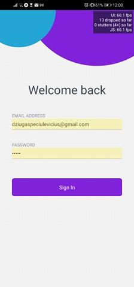
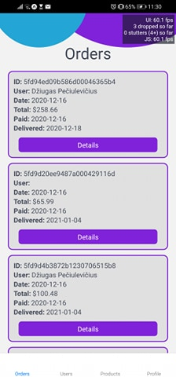
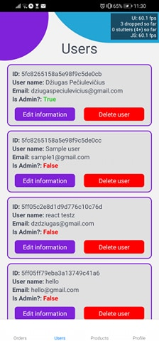
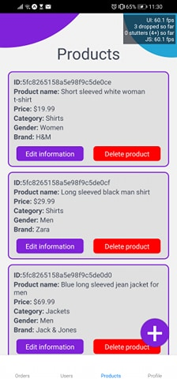
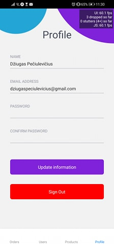

# Hybrid-Mobile-Apps-Project

This is a project for Hybrid mobile applications module. It's based on an e-commerce app that was built for Software Engineering module. This app lets admin to login into the app and view all admin related information.

admin login data is: 
email: `admin@admin.com`
password: `admin` 

<p float="left">
     &nbsp;
     &nbsp;
     &nbsp;
     &nbsp;
     &nbsp;
</p>
#### Technology Stack

Front End → React

Back End → Node.js (Express)

Database → MongoDB

---

## ES Modules in Node
We us ECMAScript Modules in the backend in this project. Be sure to have at least Node v14.6+ or you will need to add the "--experimental-modules" flag.

Also, when importing a file (not a package), be sure to add .js at the end or you will get a "module not found" error

You can also install and setup Babel if you would like

---

## Env Variables
Create a .env file in then root and add the following:

```
NODE_ENV = development
PORT = 5000
MONGO_URI = your mongodb uri
JWT_SECRET = 'abc123'
PAYPAL_CLIENT_ID = your paypal client id
```

---

## Installation
Install needed dependencies for frontend and backend:
```
npm install
cd frontend
npm install
```

---

## Running development server
```
# Run frontend (:3000) & backend (:5000)
npm run dev

# Run backend only
npm run server
```